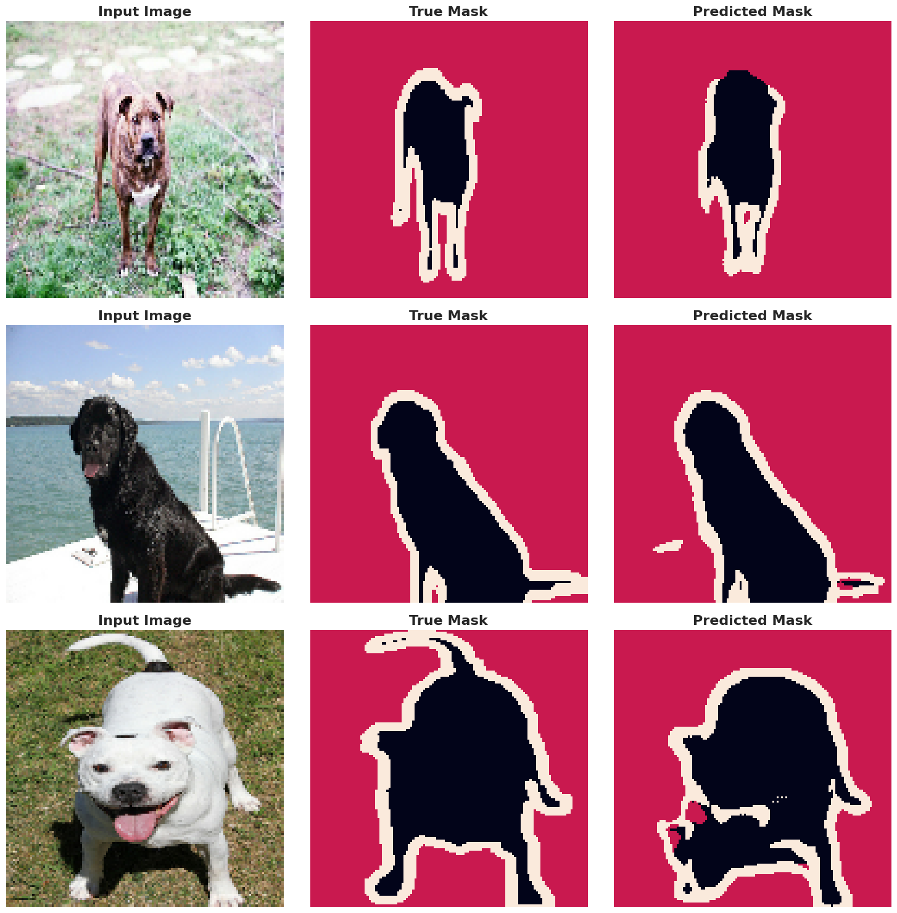

# U-Net for Image Segmentation

**Author:** Rhishi Kumar Ayyappan

---

## Project Overview

**Business Challenge:**
Manual image segmentation—the process of outlining objects in an image at the pixel level—is a critical but extremely slow, expensive, and subjective task. It's a bottleneck in fields like medical imaging (finding tumors), satellite analysis (mapping land use), and e-commerce (product isolation).

This project builds and trains a **U-Net model from scratch** to perform semantic segmentation, creating a robust framework that can automate this pixel-perfect analysis.

---

## Key Achievements & Metrics

-   **Model:** Successfully implemented a U-Net, the industry-standard architecture for segmentation, **from scratch** using the TensorFlow/Keras Functional API.
-   **Performance:** The model was trained for 20 epochs, achieving a high validation accuracy and effectively minimizing loss, demonstrating its ability to learn complex spatial hierarchies.
-   **Robust Pipeline:** Built a high-performance `tf.data` input pipeline featuring image resizing, normalization, batching, and data augmentation (random flips) for efficient GPU training.
-   **Clear Visuals:** The model produces clean, accurate segmentation masks, correctly identifying the pixels belonging to the subject (pets) versus the background.

---

## Methods Used

-   **Data:** Oxford-IIIT Pet Dataset (loaded via `tensorflow_datasets`).
-   **Model Architecture:** A classic U-Net built from scratch, featuring:
    * An **Encoder (Contracting Path)** to capture context.
    * A **Decoder (Expanding Path)** to enable precise localization.
    * **Skip Connections** to combine deep, semantic feature maps with shallow, high-resolution features.
-   **Data Pipeline:**
    * **Preprocessing:** Images normalized to `[0,1]` and masks adjusted for categorical loss.
    * **Augmentation:** Random horizontal flipping applied to the training set to improve model robustness.
    * **Batching:** Data batched into sizes of 64 with prefetching for optimal performance.
-   **Training:**
    * **Optimizer:** Adam
    * **Loss Function:** `SparseCategoricalCrossentropy` (ideal for multi-class, integer-based masks).
    * **Metrics:** Monitored `accuracy` and `loss` for both training and validation sets.

---

## Business Impact

-   **Automation:** This framework can **automate thousands of hours** of manual segmentation labor, enabling businesses to scale analysis in fields like medical AI, autonomous driving, and creative tools.
-   **Scalable Foundation:** The project serves as a foundational template that can be retrained on *any* custom dataset (e.g., product defects, crop health, internal components) with minimal changes.
-   **Enables Deeper Analysis:** Unlike object detection (bounding boxes), this model provides pixel-level data. This allows for quantitative analysis, such as calculating the *exact area* of a detected object (e.g., tumor size, flood plain area).

---

## Visuals

-   **Training & Validation Curves:** Plots showing the convergence of model accuracy and loss over 20 epochs.
-   **Sample Predictions:** A visual comparison of the **Input Image**, the **True Mask** (ground truth), and the **Predicted Mask** from the model.




---

## How to Run

1.  **Clone the repository:**
    ```bash
    git clone [https://github.com/rhishikumarayyappan/Computer-Vision-Projects.git](https://github.com/rhishikumarayyappan/Computer-Vision-Projects.git)
    cd Computer-Vision-Projects/U_Net_for_Image_Segmentation
    ```

2.  **Install requirements:**
    ```bash
    pip install tensorflow tensorflow-datasets matplotlib
    ```
    *(You can also create a `requirements.txt` file with these packages)*

3.  **Launch the notebook:**
    ```bash
    jupyter notebook U_Net_for_Image_Segmentation.ipynb
    ```

4.  **Run all cells** (Runtime -> Run all) to automatically download the data, build the model, train it, and display the results.

---

## Tech Stack

-   Python
-   TensorFlow 2.x
-   Keras (Functional API)
-   TensorFlow Datasets (TFDS)
-   Matplotlib (for visualizations)
-   Google Colab (for GPU-accelerated training)

---

**For the full implementation, model architecture, and training process, see the included Jupyter Notebook!**
