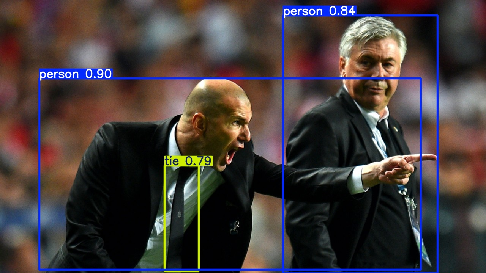
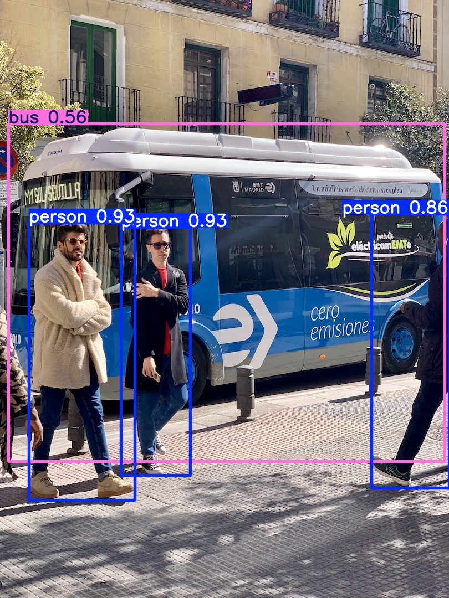

# Custom Object Detection Pipeline with YOLOv8 & Gradio

**Author:** Rhishi Kumar Ayyappan

---

## Project Overview

**Business Challenge:**
Many businesses require custom computer vision models to solve specific problems (e.g., safety gear detection, product counting, defect identification). However, the process of training, validating, and deploying these models into a usable application can be complex and slow.

This project provides an **end-to-end, reusable pipeline** for training a state-of-the-art **YOLOv8** model on a custom dataset and instantly deploying it as an **interactive web application** using Gradio.

---

## Key Achievements & Metrics

This pipeline was validated on the COCO128 dataset, achieving strong benchmark performance and demonstrating readiness for custom data.

-   **mAP50-95 (Validation):** **0.701** (Primary metric for object detection accuracy across multiple confidence thresholds)
-   **mAP50 (Validation):** **0.954** (Standard metric for detection quality at a 50% IoU threshold)
-   **Interactive Deployment:** Successfully packaged and launched the trained model as a **live Gradio web app**, allowing any user to test the model in real-time by simply uploading an image.
-   **Detailed Analysis:** Generated validation loss curves (for `box_loss`, `cls_loss`) and a confusion matrix to deeply analyze model performance, identify class-level weaknesses, and ensure no overfitting.

---

## Methods Used

-   **Model:** YOLOv8 (Ultralytics)
-   **Dataset:** COCO128 (a representative sample of the COCO dataset used for rapid prototyping and validation).
-   **Training Pipeline:**
    1.  Configured the Ultralytics environment.
    2.  Trained the YOLOv8 model on the custom dataset, saving the best-performing weights (`best.pt`).
    3.  Validated the model on a holdout test set to generate key performance metrics (mAP, Precision, Recall).
-   **Analysis:** Visualized training/validation loss curves and the confusion matrix to diagnose performance.
-   **Deployment:** Built a simple, intuitive Python-based web interface using the **Gradio** library. This app loads the saved `best.pt` weights and runs inference on user-uploaded images.

---

## Business Impact

-   **Reusable Framework:** Provides a **production-ready template** that can be rapidly adapted to *any* custom object detection task, drastically reducing development time from weeks to days.
-   **Demonstrates Full Lifecycle:** This project showcases the complete MLOps lifecycle: from training and analysis to a final, user-facing deployment.
-   **Actionable & Tangible:** The Gradio app makes the model's value **immediately tangible** to non-technical stakeholders (e.g., product managers, clients), allowing for instant feedback and demonstration of capabilities.

---


## Visuals

-   **Training & Validation Metrics:** Plots showing mAP and loss curves, confirming the model learned effectively.
-   **Confusion Matrix:** A detailed breakdown of model accuracy and confusion between classes.
-   **Sample Detections:** Example outputs from the trained model running on test images.






---

## How to Run

1.  **Clone the repository:**
    ```bash
    git clone [https://github.com/rhishikumarayyappan/Computer-Vision-Projects.git](https://github.com/rhishikumarayyappan/Computer-Vision-Projects.git)
    cd Computer-Vision-Projects/CV_YOLOv8_Custom_Object_Detection
    ```

2.  **Install requirements:**
    ```bash
    pip install -r requirements.txt
    ```
    *(Note: You will need a `requirements.txt` file containing `ultralytics` and `gradio`)*

3.  **Launch the notebook:**
    ```bash
    jupyter notebook YOLOv8_Custom_Object_Detection_with_Gradio.ipynb
    ```

4.  **Run the cells** in the notebook to train the model and launch the Gradio web interface.

---

## Tech Stack

-   Python
-   PyTorch
-   Ultralytics YOLOv8
-   Gradio (for web deployment)
-   NumPy
-   Matplotlib (for visualizations)
-   Google Colab (for GPU-accelerated training)

---

**For full code, training logs, and the interactive demo, see the included Jupyter Notebook!**
